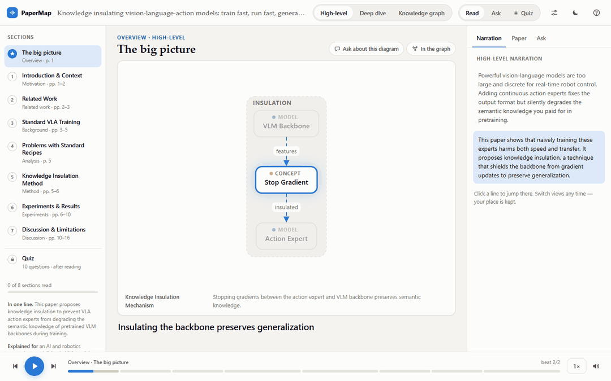

# PaperMap

Turn a scientific paper into an interactive, narrated walkthrough written for one specific reader.



You give it a paper (a PDF or an arXiv link) and a short `profile.md` describing the reader. It builds one self-contained web page with:

- **High-level and deep-dive views.** Section-by-section narration with diagrams that highlight what is being explained.
- **A knowledge graph.** How the paper connects to prior work, models, datasets and concepts.
- **Ask any time.** Questions while you read, answered from the paper with links back to the sections they come from.
- **A quiz at the end.** It unlocks once you have read every section. It has 10 or more multiple-choice questions, each with an answer key checked against the paper. You get a score, and each question you missed points to the part of the narration and the passage in the paper to revisit.
- **Stays close to the paper.** Uses the arXiv LaTeX source when available (exact equations, tables, figures), shows the paper's own figures, and opens the source page with the quoted passage highlighted. Numbers are checked against the paper, and a fact-checking pass reviews the narration.

It runs with local models (Ollama, vLLM, llama.cpp, LM Studio) or with cloud APIs.

## Install

Python 3.11 or newer.

```bash
git clone https://github.com/iFarhat93/papermap.git
cd papermap
pip install -e ".[all]"
```

The command-line tool is called `papermap`.

## Try the example

[`examples/attention-is-all-you-need`](examples/attention-is-all-you-need) is a finished page for *Attention Is All You Need*. Open its `index.html` in a browser; nothing else is needed. To generate it yourself with a local model (see [Use a local model](#use-a-local-model)):

```bash
papermap https://arxiv.org/abs/1706.03762 --profile examples/profile.example.md --provider ollama --model qwen2.5:7b
papermap serve papermap-out/1706.03762-profile.example
```

## Run

```bash
# 1. write a profile.md describing the reader (see examples/)
papermap init

# 2. generate (here with a local model through Ollama; any PDF path works too)
papermap https://arxiv.org/abs/1706.03762 --profile profile.md --provider ollama --model qwen2.5:7b

# 3. open the result (the local server answers your questions)
papermap serve papermap-out/1706.03762-profile
```

Optional flags: `--tts edge` adds real voice audio, `--style duo` switches to a host-and-expert conversation, and `--no-quiz` skips the quiz. Re-running is instant because every step is cached.

Other providers (vLLM, llama.cpp, LM Studio, OpenAI-compatible and Anthropic APIs), voices, configuration and debugging are covered in [docs/GUIDE.md](docs/GUIDE.md). How it works is in [docs/ARCHITECTURE.md](docs/ARCHITECTURE.md).

## Use a local model

The simplest way to run the model on your own machine is [Ollama](https://ollama.com):

1. Install Ollama from [ollama.com/download](https://ollama.com/download) and start it. It listens on `localhost:11434`, where PaperMap looks by default.
2. Download a model:
   ```bash
   ollama pull qwen2.5:7b
   ```
3. Generate with it:
   ```bash
   papermap paper.pdf --profile profile.md --provider ollama --model qwen2.5:7b
   ```

`papermap serve` then answers your questions with the same model. A 7B model is enough to try PaperMap. A larger one writes better narration and diagrams, if your machine can run it.

## Time and cost

One full page for *Attention Is All You Need* (15 pages):

| Model | Runs on | Time | Cost |
|---|---|---|---|
| `qwen3.8:27b` (tested) | Ollama, RTX 5070 Ti (16 GB) | 40 min | free |
| `claude-sonnet-5-5` or `gpt-6.1-sol` | Anthropic or OpenAI API | about 5 min | about $0.80 |
| `claude-opus-5-5` | Anthropic API | about 5 min | about $1.70 |

## License

MIT
