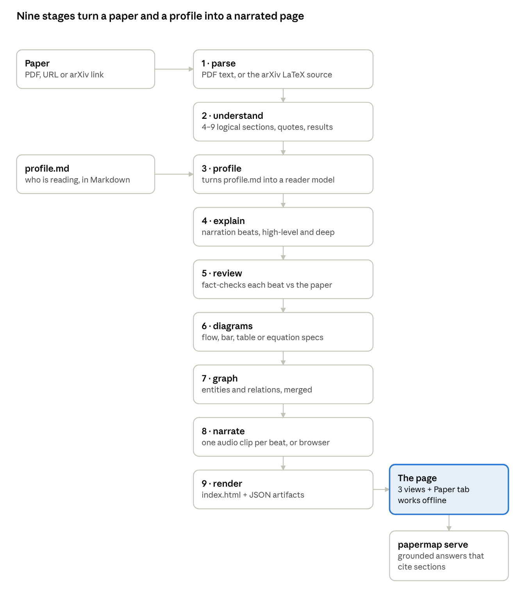
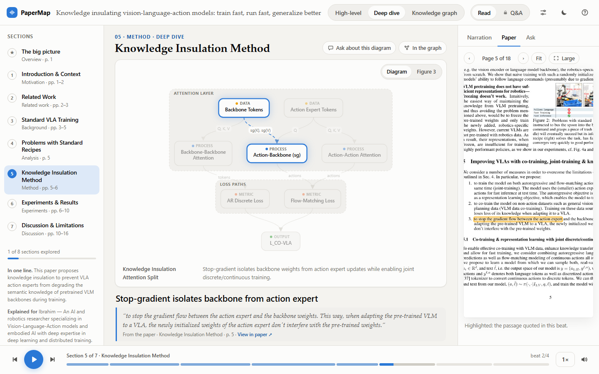
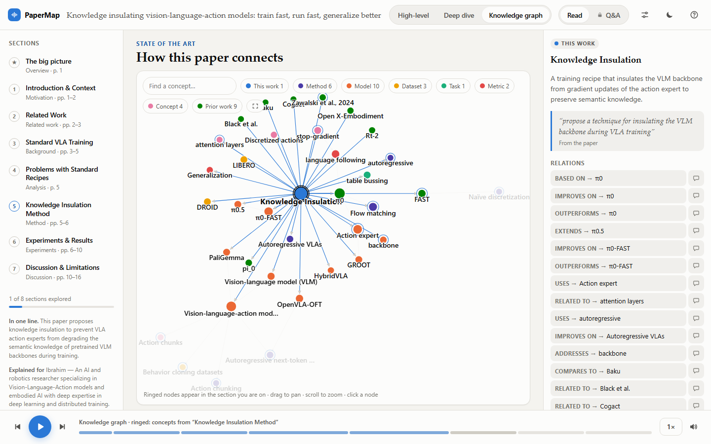
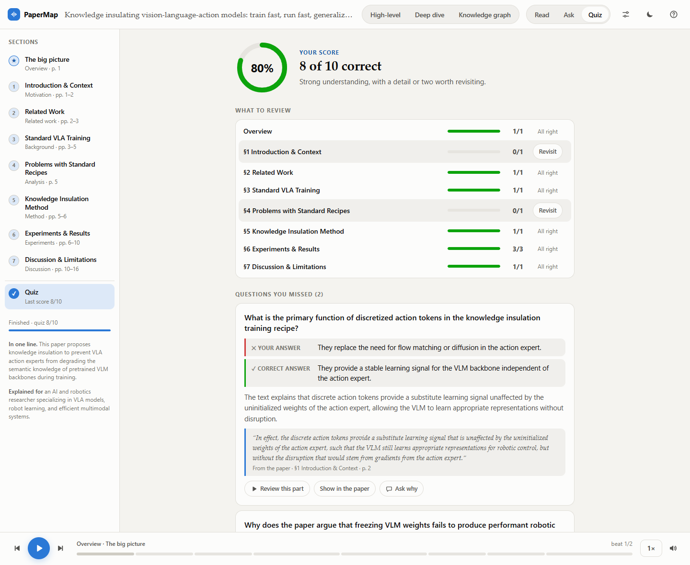

# Understanding papers with PaperMap

The goal is simple: understand a paper faster, the way a human expert would explain it to you, layer by layer. PaperMap turns a dense paper into a narrated, diagram-driven walkthrough written for one reader. This page uses [Knowledge insulating vision-language-action models: train fast, run fast, generalize better](https://arxiv.org/abs/2505.23705) (Driess et al., 2025, the π0.5 knowledge-insulation paper) as the running example.


## Why

Reading a paper front to back is rarely how understanding happens. The knowledge-insulation paper is 18 pages: a mixture-of-experts architecture, two training objectives, half a dozen baselines, and results spread over real-robot tasks, LIBERO and DROID. Its idea fits in one sentence (train the VLM backbone on discretized actions, and stop the gradients of the new continuous action expert from reaching it), but finding that sentence, and seeing how the loss, the attention masks and the experiments support it, is the real work. The method is on page 5, the evidence on pages 6 to 10, and the models it is compared with (π0, π0-FAST, OpenVLA-OFT, HybridVLA) are scattered through the text.

An expert who already read the paper does not hand you the PDF. They explain it in layers: first the one idea and why it matters, then the mechanism drawn on a whiteboard, then the key sentences and tables from the paper itself, and finally your questions, answered from the paper. PaperMap builds that layered walkthrough, written for what you already know.

## What it does

You give it a paper (a PDF or an arXiv link) and a short `profile.md` describing the reader. It builds one self-contained web page whose parts are the layers of that explanation: a high-level walkthrough (the idea), a deep dive (the mechanism), a knowledge graph (how it relates to prior work), and a Paper tab that shows the PDF page behind each sentence with the quoted passage highlighted (the paper's own words). `papermap serve` answers your questions from the paper at any time, and a quiz at the end checks what you understood. It runs with local models (Ollama, vLLM, llama.cpp, LM Studio) or with cloud APIs.



Two design choices make it a tool for understanding a paper rather than summarizing it:

- **The profile drives the writing.** Concepts the reader already knows are not re-explained, missing ones get a short definition, and analogies come from fields the reader knows.
- **Grounding runs in code, not in the prompt.** Quotes must appear verbatim in the paper or they are dropped. Numbers in the narration and in charts must appear in the section text, next to the label they are attributed to. Graph entities must be named in the paper. A second model pass fact-checks every section, an independent pass re-checks every quiz answer key, and answers to questions must cite sections.

## Example: the knowledge-insulation paper

One command, a local 27B model (Qwen 3.8 through Ollama) and Edge voices:

```bash
papermap https://arxiv.org/abs/2505.23705 --profile profile.md --provider ollama --model qwen3.8:27b --tts edge -o papermap-out/pi05-ki
```

The run took 51 minutes: 70 model calls, 188k input and 44k output tokens. PaperMap found the arXiv LaTeX source, so it read exact sections, equations and tables, and it located all 26 quoted passages on the PDF pages. The profile was [examples/profile.example.md](../../examples/profile.example.md): a robotics researcher who knows VLAs, attention and flow matching, wants the mechanism and the evidence, and dislikes hype.

**Structure.** The 18 pages became 8 sections, from *The big picture* to *Discussion & Limitations*, each mapped to its pages. The one-line summary it extracted: "This paper proposes knowledge insulation to prevent VLA action experts from degrading the semantic knowledge of pretrained VLM backbones during training."

**High-level view.** 17 beats, about 4.5 minutes of narration. The first beat, and the verbatim quote it chose from page 1:

> Powerful vision-language models are too large and discrete for real-time robot control. Adding continuous action experts fixes the output format but silently degrades the semantic knowledge in the backbone. This paper identifies that conflict and proposes knowledge insulation to protect the VLM during training.
>
> *"showing that naively including such experts significantly harms both training speed and knowledge transfer"*

**Deep dive.** 34 beats, about 8 minutes. For the method section it drew the pretrained backbone and the action expert, with an insulation layer of stop-gradient keys and values between them. While the first beat plays, the backbone and expert blocks light up and the Paper tab opens page 6 with the quoted sentence marked. On the next beat, the highlight moves to the stop-gradient nodes.



**Knowledge graph.** 36 nodes and 52 edges, every one named in the paper. It says in one picture what Related Work says in two pages: knowledge insulation is based on π0, extends the two-stage recipe of π0.5, improves on π0-FAST, outperforms HybridVLA and OpenVLA-OFT, uses PaliGemma, FAST tokens, flow matching and a stop-gradient, and is evaluated on LIBERO, DROID and table bussing.



**Fact-check.** A first-draft beat said the method "surpasses MoDE and OpenVLA-OFT" on LIBERO. The review pass compared that with Table 1: true on LIBERO-90 (96.0 vs 95.0) and LIBERO-Spatial (98.0 vs 97.6), false on LIBERO-Object, LIBERO-Goal and LIBERO-10 (85.8 vs 94.5). The beat now says the method "underperforms OpenVLA-OFT on the Object, Goal, and Long-horizon tasks". Earlier in the run, the attribution check had rejected a table that listed the paper's 750 ms latency under "Autoregressive", a label the paper does not put next to that number, and the model rewrote the row.

**Q&A.** Asked from the method section, *what exactly does the stop-gradient block, and what still updates the backbone?* The answer (trimmed; the local model took about three minutes):

> The stop-gradient operator sg is applied specifically to the **key** and **value** projections of the backbone within the attention mechanism, preventing gradients from the continuous action expert's flow-matching loss from backpropagating into the pre-trained VLM weights [s5]. However, the backbone is still updated by the **autoregressive discrete action prediction** loss (using FAST tokens) and the standard language modeling loss [s5][s7]. The attention mask ensures that discrete FAST tokens cannot attend to continuous action tokens, and vice versa [s5].

Asked *is the method state of the art on all LIBERO subsets?*, it answered no, cited [s6] and quoted the paper's own "worse on LIBERO-10", but the two baseline numbers it gave came from the LIBERO-90 column of Table 1. The citation chip jumps to the section and the table is one click away, so the check takes seconds. That is the division of labor: the model gives the walkthrough, the paper stays the authority.

**Quiz.** Once every section has been read, a quiz opens. It has 10 multiple-choice questions spread over all 8 sections, from what the stop-gradient blocks to the DROID scores. A second pass checked each answer key by answering from the paper alone, with the options shuffled. The results show the score and which sections to revisit. For every miss they show the right answer, why it is right and the sentence from the paper, with buttons that jump to the narration beat or open the highlighted page.



## How to use it

```bash
git clone https://github.com/iFarhat93/papermap.git
cd papermap
pip install -e ".[all]"        # Python 3.11 or newer
```

1. **Describe the reader.** `papermap init` writes `papermap.toml` and a `profile.md` template. The profile is free-form Markdown: who is listening, what they know well, what is new to them, what they want from a paper, how deep to go, and the tone.
2. **Generate.** `papermap https://arxiv.org/abs/2505.23705 --profile profile.md --provider ollama --model qwen2.5:7b`. A 7B model is enough to try the page; a 27B model, or a cloud model with `--provider anthropic`, writes better narration and cleaner diagrams. If a run fails halfway, run the same command again: completed work is cached and it resumes from the last finished model call.
3. **Open it.** `index.html` opens from disk and works offline. To ask questions, serve the folder, because answering needs a model: `papermap serve papermap-out/<folder>`. Press play; switch between high-level and deep dive at any time; click "View in paper" on a quote to see it on the PDF page.
4. **Ask.** The Ask tab answers questions about the section, diagram or graph node you are on, and the Ask mode takes any question at any time. Answers carry `[s5]`-style chips that jump to the cited section.
5. **Take the quiz.** It unlocks once you have read every section. Each question you miss links to the part of the narration and the passage in the paper that answer it.

**What a full page costs.** The numbers below are for the 18-page knowledge-insulation paper (70 model calls, 188k input and 44k output tokens). The local rows are measured; the cloud rows are rough estimates at list prices (October 2026), before prompt-caching discounts and without thinking tokens, so treat them as ±50%.

| Where it runs | Model | Wall time | Cost |
|---|---|---|---|
| RTX 5070 Ti (16 GB), Ollama | qwen3.8:27b Q4, partly on CPU, one call at a time | 51 min measured (43 min model, 7 min Edge voices) | free |
| RTX 5070 Ti (16 GB), Ollama | qwen2.5:7b, 4 calls in parallel | 4 min measured (15-page paper, browser voice) | free |
| Anthropic API | claude-sonnet-5-5 / claude-opus-5-5 | 5 to 10 min (estimate) | about $0.8 / $1.6 |
| OpenAI API | gpt-5 / gpt-6.1-sol | 5 to 10 min (estimate) | about $0.7 / $0.8 |

Edge voices are free and add about 7 minutes whichever model writes the text; the browser voice adds nothing.

`--style duo` turns the narration into a host-and-expert conversation, `--tts` adds real voices (Edge, or any OpenAI-compatible speech server), and every stage writes its output to `debug/<stage>.json`. Configuration, providers and debugging are in [GUIDE.md](../GUIDE.md); the internals are in [ARCHITECTURE.md](../ARCHITECTURE.md).

## Limits and what's next

PaperMap does not replace reading the paper; it changes the order. The one-sentence idea, the mechanism drawn, the evidence in a chart and the sentence behind each claim come before the PDF. A model can still misread a correct passage, and the checks catch quotes and numbers, not reasoning. Scanned PDFs need OCR first. Q&A needs a running model and is not streamed yet. Next on the list: streaming answers and HTML papers.
